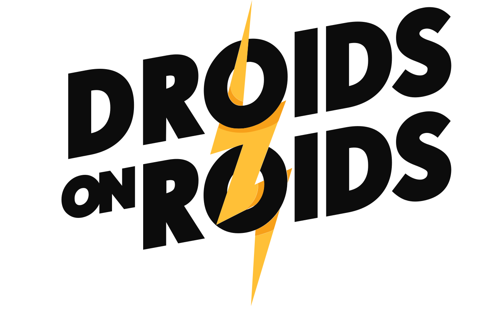
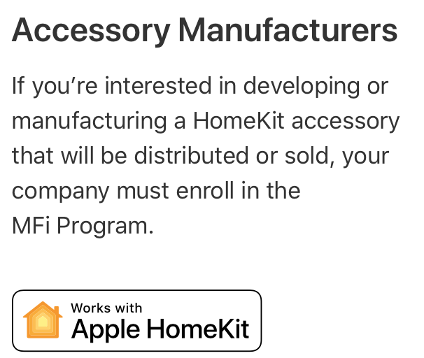
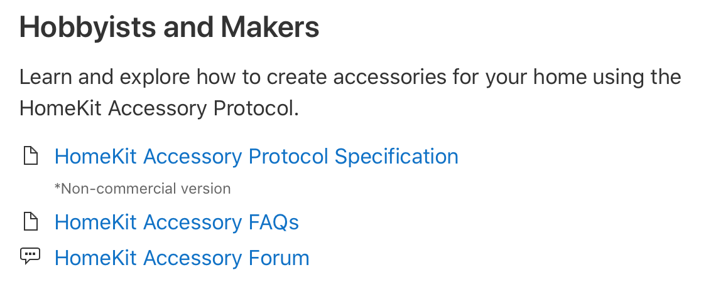
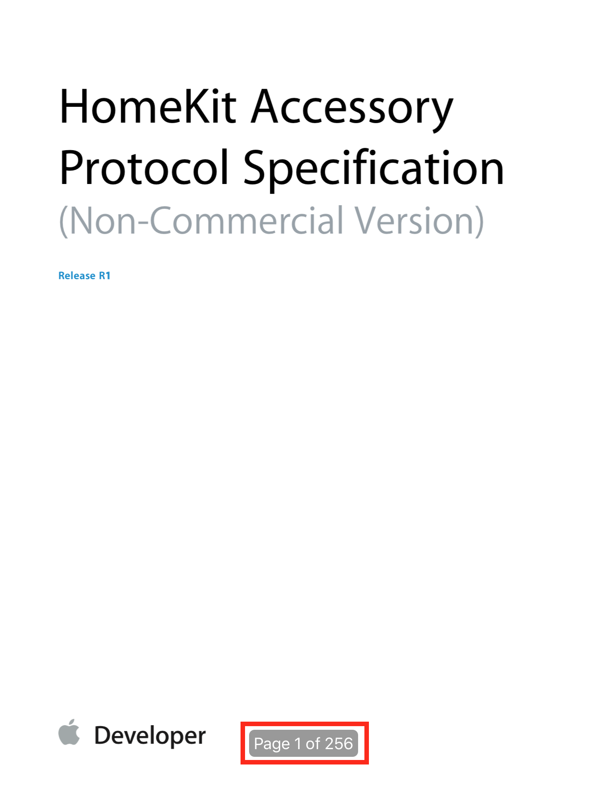

build-lists: true
slidenumbers: true

# MacBulb
### How to add HomeKit compatibility to every* device
#### Sebastian Osiński
---
# About me

### iOS Developer at


---
# Creating HomeKit accessory
## Two ways:

- Commercial
- Non-commercial

---
# Commercial



---
# Non-commercial



---
# HomeKit Accessory Protocol Specification



---
# HomeKit Accessory Protocol Specification


---
## Homebridge to the rescue!

---
# Homebridge
*  Allows to 'HomeKitify' every device which has some kind of interface to interact with
* Most of the time installed on Raspberry Pi
* Based on HAP-NodeJS - HomeKit Accessory Protocol implementation
* Based on system of plugins - adding support for some device is done by writing plugin - NPM module

---
## HomeKit basics

---
# Home
<br>
Place with accessories, just that ;)

---
# Room
<br>
Contains group of accessories in given Home. One accessory can belong to only one Room.

---
# Accessory
<br>
Represents single device.

---
# Service
<br>
Single functionality of an accessory. One accessory can have multiple services, e.g. be a bulb and light sensor simulataneously.

---
# Characteristic
<br>
Single property of a service. E.g. bulb has on/off characteristic and, among many others, brightness characteristic.

---
# Bridge
<br>
Special kind of accessory which enables access to other accessories which are not compatible with HomeKit directly.

---
# Plugin development steps
* Create NPM module which name starts with "homebridge"
* Find appropriate service(s) for your device
* Code!

--- 
# Example

---
# MacBulb
Simple MacOS app with REST API:

* GET/PUT `power`
* GET/PUT `hue`
* GET/PUT `saturation`
* GET/PUT `brightness`

---
# Creating plugin
```bash
mkdir homebridge-macbulb; cd homebridge-macbulb

npm init

npm link

```

---
# Adjusting package.json
```json
{
  "name": "homebridge-macbulb",
  "version": "1.0.0",
  "description": "",
  "keywords": [
    "homebridge-plugin"
  ],
  "main": "index.js",
  "scripts": {
    "test": "echo \"Error: no test specified\" && exit 1"
  },
  "author": "Sebastian Osiński",
  "license": "ISC",
  "engines": {
    "node": ">=0.8",
    "homebridge": ">=0.1"
  },
  "dependencies": {
    "request": "^2.88.0"
  }
}
```

---
# Plugin entrypoint

```js
module.exports = function(homebridge) {
    Service = homebridge.hap.Service;
    Characteristic = homebridge.hap.Characteristic;
    homebridge.registerAccessory("homebridge-macbulb", "MacBulb", MacBulb);
};

function MacBulb(log, config) {
	this.log = log;
	this.name = config.name;
}
```

---
# Plugin's "heart"

```js
MacBulb.prototype = {
	getServices() {	
		const bulbService = new Service.Lightbulb(this.name);

		bulbService
			.getCharacteristic(Characteristic.On)
			.on('get', this.getOn.bind(this))
			.on('set', this.setOn.bind(this));

		bulbService
			.getCharacteristic(Characteristic.Hue)
			.on('get', this.getHue)
			.on('set', this.setHue.bind(this));

		... // Saturation and Brightness characteristics

		return [bulbService];
	}

    ...
```

---
```js 
getHue(callback) {
	request
		.get(baseUrl + "/hue")
		.on('data', function(data) {
			json = JSON.parse(data)
			callback(null, json["value"])
		})
		.on('error', callback);
},

setHue(level, callback) {
	request
		.put(baseUrl + "/hue")
		.form({value: level})
		.on('response', function(response) {
			callback(null);
		})
		.on('error', callback);
}
```

---
# DEMO!

---
# THANKS!
<br>
## This presentation can be found here:
https://osinski.dev/talks

---
# Sources

* [https://developer.apple.com/homekit](https://developer.apple.com/homekit/)
* [https://homebridge.io](https://homebridge.io)
* [https://github.com/KhaosT/HAP-NodeJS](https://github.com/KhaosT/HAP-NodeJS)

---
## QUESTIONS?